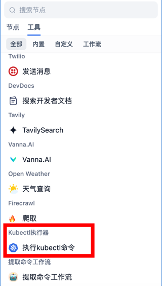

## 说明
给Dify 扩展工具的示例，不需要改源码，将kubectl文件夹挂载到/app/api/core/tools/provider/builtin目录下，启动后，即可看到内置工具中出现本示例了。
非常方便

## kubectl来源
基于官方镜像，增加kubectl命令
从`bitnami/kubectl:latest`镜像中将kubectl复制到dify_api镜像中

## docker-compose更新
1. 更新`langgenius/dify-api:0.6.11`为`langgenius/dify-api:0.6.11_kubectl`
2. 更新volumes:
      # Mount the storage directory to the container, for storing user files.
      - ./volumes/app/storage:/app/api/storage
      - ./volumes/plugins/kubectl:/app/api/core/tools/provider/builtin/kubectl
      - /root/.kube/config:/root/.kube/config

## 效果
* 界面可上可以看到在内置工具中增加了`kubectl执行器`
* 
